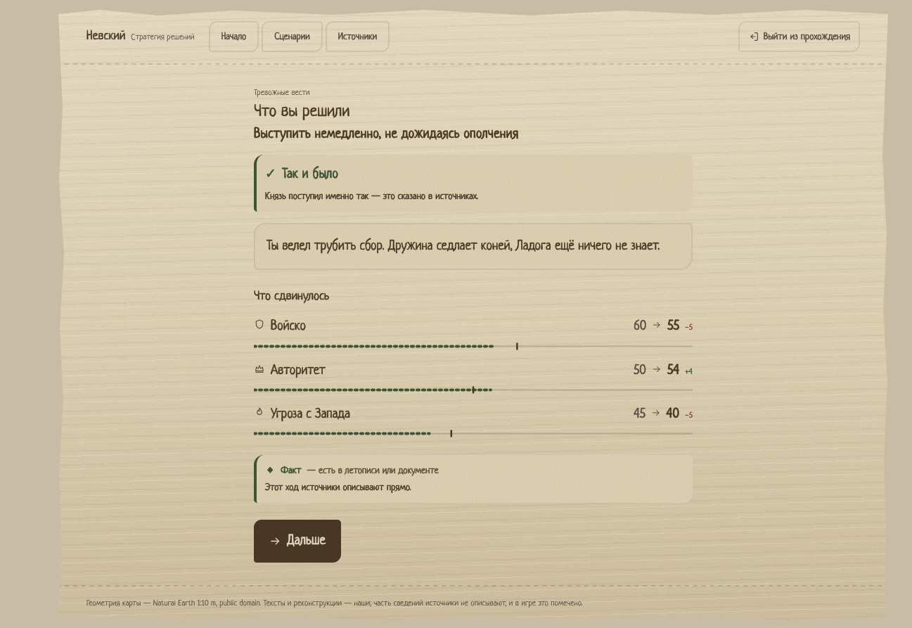

# Невский: Стратегия решений

Образовательная историческая игра о решениях. Одна кампания — **«Нева, 1240»**.

Вы — князь Александр Ярославич, девятнадцати лет, второй год в Новгороде. Шведские
суда вошли в Неву. Каждое решение двигает войско, казну, авторитет, устойчивость
и тревогу на двух границах — а в конце видно, что получилось и что об этом известно
на самом деле.

## Как играть прямо сейчас

Двойной клик по **`release/nevsky.html`**.

Один файл, 2,7 МБ: стили, карта и все изображения лежат внутри него. Сеть не нужна —
можно открыть с флешки.

## Что это за игра

13 событий, 32 решения, **4320 полных прохождений**.

Двенадцать решений зависят от пройденного пути: одни двери отпираются только тем, кто
раньше поступил иначе, другие — запираются тем, что вы уже сделали. Закрытая дверь не
исчезает: она остаётся на экране и говорит, чем именно закрыта.

Главное правило: игра не говорит «верно» и «неверно». После каждого хода она говорит,
что **об этом известно**:

- **✓ Так и было** — ход князя, названный в источниках;
- **✗ Так не было** — и рядом назван ход, который источники приписывают князю;
- **? Летопись об этом молчит** — как поступил князь здесь, неизвестно.

У каждого утверждения есть род знания: **факт**, **реконструкция**, **предание**,
**догадка**. Знание бывает твёрдым и нет — игра это показывает, а не сглаживает.



## Запуск и разработка

Нужен Node 20+ (проверено на 20.19.2) и npm 9+.

```bash
npm ci                  # поставить зависимости строго по lock-файлу

npm run dev             # экран разработки
npm test                # 200 тестов: движок, контент, карта, экраны, читаемость
npm run typecheck       # строгая типизация
npm run validate        # проверка контента, код возврата 1 при поломке

npm run build:offline   # собрать один файл → web/dist-offline/index.html
npm run release         # то же плюс положить в release/nevsky.html
```

`npm run release` перед копированием сверяет число вшитых подлинников с тем, что
обещает контент, и отказывается класть в `release/` сборку без картинки.

## Из чего состоит

- **`core/`** — движок и контент. Чистый TypeScript: типы, схема проверки на Zod,
  детерминированные вычисления. Один и тот же выбор всегда даёт один и тот же итог.
  Сети не требует, ИИ не использует нигде.
- **`web/`** — экраны. React 19, Vite, Tailwind 4. Оформление — береста: письмо
  процарапано в поверхность, а не напечатано поверх неё.
- **`tools/`** — подготовка данных: геометрия карты из Natural Earth 1:10m, выкачка
  подлинников с Викимедиа, сборка релиза.
- **`raw-images/`** — оригиналы изображений и манифест: у каждой вещи автор, дата,
  лицензия и ссылка на источник.
- **`release/`** — готовая игра одним файлом.
- **`tools/geo/build_geo.py`** — генератор геометрии карты; его вывод лежит готовым
  в `core/src/map/geography.json`.

## Честно о карте и об изображениях

**Карт русских земель XIII века не существует.** Первые карты этих мест появляются
в XVI веке. Поэтому карта в игре — не старинный документ, а реконструкция, собранная
из летописей, археологии и палеогеографии. Там, где источники молчат — место шведского
стана, точное место боя, — показано несколько возможных точек с зоной неопределённости,
а не одна уверенная.

**Изображения — только под свободными лицензиями:** Public domain (6) и CC0 (4).
Среди них есть подлинники XIII века — берестяная грамота, наносник шлема, печать
Биргера Ярла — и позднейшие свидетельства: миниатюры Лицевого свода и житийная икона
XVI века, гравюра 1720 года. Под каждым указано, **свидетель это эпохи или позднейшее
свидетельство о ней**. Тест падает, если поздняя вещь подписана как современница
событий.

## Чего здесь намеренно нет

- **Сервера** — вся игра идёт в браузере, отдельного бэкенда нет.
- **Базы данных, админки, кабинета преподавателя** — отложены.
- **ИИ-советника** — появится, когда рядом встанет серверная часть.
